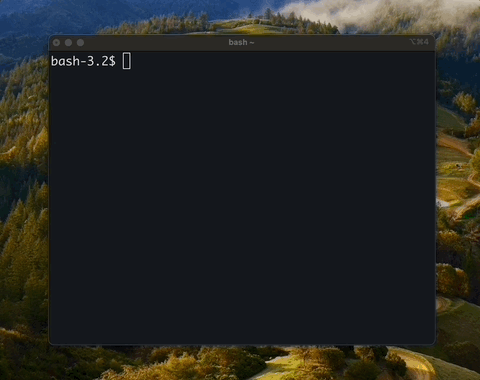

# cmd

`cmd` is a command-line interface to generate scripts, transform text, transcribe audio, search images or simply reminding you that command option that you were about to google.

## Install

```bash
$ brew tap daulet/cmd && brew install cmd
```

## Features

### Run model output

`cmd -r build a snake game`



<details>

To run the generated shell command or code, use `--run` (alias `-r`):
```bash
$ cmd --run print third last commit hash
To print the third last commit hash, you can use the following Git command:

bash
git log --pretty=format:"%H" -n 1 --skip 2

This command will display the commit hash of the commit that is two commits before the most recent one. The `--pretty=format:"%H"` option specifies that you want to display the commit hash in the output, and the `-n 1` option limits the output to only one commit. The `--skip 2` option skips the two most recent commits and displays the hash of the third last commit.
a200e6d429e2888344d7254ac02a00618ab432a2
```
Supported languages include Go, Bash, Python and HTML. The language is assumed from identifier immediately following backticks of fenced code blocks, hence it could be error prone if no language is specified, or if code is broken down into multiple blocks (common for HTML).

</details>

### Run without output


<details>

_Only_ execute generated command or a script (like `--run`), _without_ actually outputing it (useful for piping), use `--execute` (`-e`), which will not output generation hence be patient:
```bash
$ cmd --execute print shell command to brief description for last five commits
27a6a07 add an option to execute generate command
ac88d6a parse code blocks as we stream, not after the fact
a200e6d simplify now that code parsing is async
6d36937 rename Buffer to Code
d42893c (HEAD -> main, origin/main) simplify code parser, make exec truly optional
```

</details>

### Pipe

```bash
cat README.md | cmd describe in one line

`cmd` is a command-line interface that pipes data to LLMs for code generation, shell commands, or text, offering interactive mode, model configuration, and execution options.
```

Chat with audio: pipe transcription (which could be expensive operation time-wise due to audio size) to interactive mode (`cmd -i`) to ask as many questions as you want with the same audio context:
```bash
cmd -f audio.mp3 | cmd -i
```

### Interactive mode

To start a multi turn chat session use `-i`:
```bash
$ cmd -i
User> (your message)
```

Which is also compatible with other flags, like `--run`, that can be used to iterate on a solution:
```bash
$ cmd -r -i
User> html for a bouncing ball
```

### Configure

You can check current configuration using `cmd --config`, and to change it use:
* `--model` to set the model (use `--list-models` to see your options);
* `--connector` to set connectors (use `--list-connectors` to see your options);
* `--temperature` to set the temperature;
* `--top-p` to set the top P;
* `--top-k` to set the top K;
* `--freq` to set the frequency penalty;
* `--pres` to set the presence penalty;
```bash
$ cmd --connector web-search --connector google-drive
```

# Cool use cases

## Search images

```
find images -maxdepth 1 -type f -name "*.jpg" -exec cmd -f {} is this image of llama \; -print

No, this image is of a penguin, not a llama. It is a black and white drawing of a penguin on white and black background.
images/penguin.jpg
Yes, the image shows a llama wearing sunglasses.
images/llama.jpg
```


## Read PDF document

Pipe with xpdf (`brew install xpdf`) or similar:
```bash
$ pdftotext -nopgbrk -eol unix -q document.pdf - | cmd tldr
```

## Use web search

Seemingly unrelated tasks could benefit from web search, e.g. here is a result of `cmd -run html for a bouncing ball`:


and here is the result with web search enabled (`cmd -connectors web-search`):


## Data transformation

A common mundane task that this tool could simplify is transforming or otherwise parsing data from one format to another. However, there are multiple ways to approach this, e.g. you could ask LLM to transform the data directly, or you could ask cmd to write a program to transform the data. The better solution depends on the amount of data you have, and the complexity of the transformation.
```bash
cat house-prices.csv | cmd convert to json
```json
[
    {
        "Home": 1,
        "Price": 114300,
        "SqFt": 1790,
        "Bedrooms": 2,
        "Bathrooms": 2,
        "Offers": 2,
        "Brick": "No",
        "Neighborhood": "East"
    },
    { ...
```

Programmatic approach (program is still written by LLM):
```bash
cat house-prices.csv | cmd --execute write python program to convert this to json and read the data from house-prices.csv
[
    {
        "Home": "1",
        "Price": "114300",
        "SqFt": "1790",
        "Bedrooms": "2",
        "Bathrooms": "2",
        "Offers": "2",
        "Brick": "No",
        "Neighborhood": "East"
    },
    { ...
```

Of course whichever approach you choose, you can always pipe the output to another command to further process it.

```bash
cat house-prices.csv | cmd --execute write python program to convert this to json and print it out, read the data from house-prices.csv | cmd --run run python program to plot this data
```
